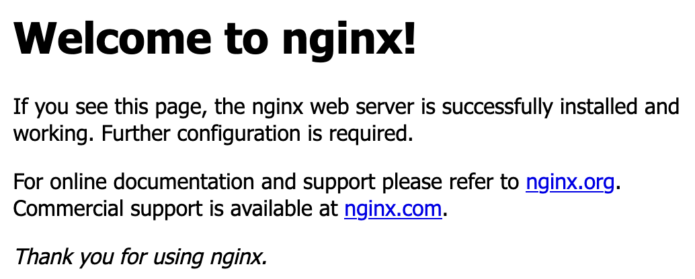

# Docker

Docker is an implementation of Linux containers and a set of tools used for
building and running containers. We will take a look at how to build and run
some simple containers and do some exercises to get to know the docker tool
suite.

## Containers vs. Images

First of all we need to explain the difference between docker containers and
docker images.

- Images consist of a set of filesystem layers. The sum of these make up the
  final image. When starting a docker container, we instruct docker what image to
  use.
- A containers is a running instance of an image.

The equivalent in the world of virtual machines are virtual machine images and
virtual machine instances. Like with virtual machines instance, we can have
multiple container instances running the same docker image.

## Dockerhub and other docker image registries

Docker images do not provide much value when we only have them on our own
machine, which is why we have docker image registries. A registry is simply a
place where docker images are stored.

Dockerhub is the "official" docker registry, but now a days a lot of
alternatives exist for storing. Some of them are offered as paid services,
while others allow you to run and manage the registry yourself.

All of the major cloud providers have services where you can provision your own
registry hosted on their servers. For hosting on-prem [JFrog
Artifactory](https://jfrog.com/artifactory/) and [Habour](https://goharbor.io/)
are some popular choices.

{}
Note that registries host images and **not** containers.
{}

## Exercises

We will do a few exercises where we build and run docker containers.

### Run nginx

As a first step you should run the nginx docker image so that you se the
default nginx server output in the browser. The nginx image is available on
Dockerhub, so we don't need to build an image. We just want to see the default
like shown in the following screenshot:

*Hint:* Use the `docker run` command to run the image. Use the `-p` flag to map
the nginx port to a port on your host machine. For more information about the
command and available flags, run `docker run --help`.
