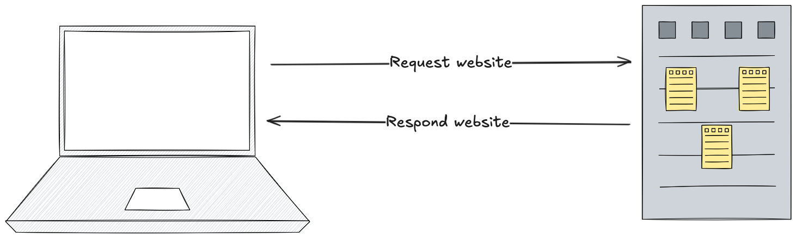
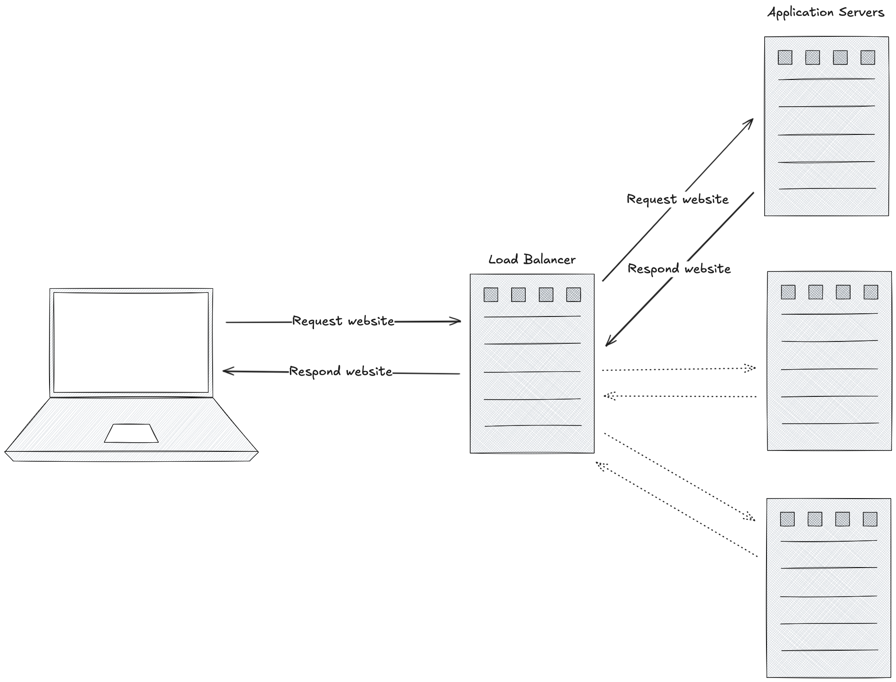

# A brief look at history

In order to fully understand why we even need technology like Kubernetes and
why it has gained its popularity, we will need to take a brief look at history
and understand where we are coming from.

First of all this historical perspective is very simplified, but serves to help
understanding the need for Kubernetes.

## Single server / Physical Machines

Before we had virtual machines, we had physical servers which hosted our
applications.

Physical servers have a lot of downsides, as they require physical management.
I won't go into much detail, but the essence is that it is hard to scale
applications as that would require introducing bigger physical machines
(vertical scaling) or more complicated setups had multiple physical machines
(horizontal scaling).

## Virtual machines

Virtual machines revolutionized efficiency as server management now required
way less management of physical servers as single physical servers were now
able to act as multiple servers. On top of that management of the virtual
servers didn't require physically doing something in a datacenter.

But virtual machines still have some downsides in common with the single server
setups. Applications often need to run on a specific OS and they might rely on
certain runtimes being installed and configured.

### Server Configuration management tools

Imagine having to migrate an
application which relies on the server being configured in a certain way, this
is hard because the new server needs to be configured exactly like the old one
in order to guarantee that it works in the same way.

In order to ease this problem configuration management tools like
[chef](https://www.chef.io/), [puppet](https://www.puppet.com/) and
[ansible](https://www.redhat.com/en/ansible-collaborative) started emerging.
These tools made it easier for server admins to replicate server setups as the
configuration could now be declared, and the setup process automated.

### Virtual machines take time to configure

Imagine wanting to spin up your new application on a server. You would now have
to provision a VM this will take some time. Now you have a bare VM which isen't
really useful in itself, you will have to run your server config management
tool first. The configuration management tool runs installers for all of the
required components that you application needs, this might also take a lot of
time. When you are finally done with that, the server is ready for your
application.

## A new era: Containerization

At a point Linux namespaces made way for containerization. This enabled
seggregation like with virtual machines, but instead of having to provision a
new VM, containers would run on a server and share the same underlying OS
kernel.

This was revolutionizing as you could now ship your application in a container
image where the image contained all of your application's dependencies like
runtimes, other applications etc.

In addition where as a VM might take anywhere from a few minutes to hours to
provision and get ready for your application, a container could start in a few
seconds and maybe even less than that.

### Easy containerization: Docker

Docker suceeded in making this new Linux capability very easy for developers to
leverage. A big part of the success of the container technology can be
accredited to Docker.

Docker made a way to easily define how a container image should be built and
created a simple CLI for building and running containers.

## The scalability problem

For most smaller companies these technologies would be sufficient. But some
applications need to be scaled horizontally as there is a limit to how big the
underlying physical server can be (vertical scaling).

This is solvable using one of the server configuration tools we mentioned
earlier. We can even host multiple unrelated applications easily by leveraging
containerization. But we have to deploy the same application on multiple
servers in order to scale.

Now the problem is no longer managing configuration of multiple servers, we now
have a problem which is that we need to deploy the same application in multiple
places and we need to be able to deploy new versions easily. But what if
application A only needs to run at small scale while application B needs to run
at a bigger scale? The loadbalancer needs to know which servers hosts the
application that the request is for. This quickly becomes a tangled mess and
hard to manage.

### The solution: Kubernetes

Kubernetes builds on top of containerization. You can think of kubernetes as an
orchestrator which has the responsibility for deploying application to servers
and keeping track of where they live.

Kubernetes is a distributed system which runs across multiple physical and/or
virtual servers. Kubernetes abstracts away the underlying servers by offering
APIs for declaring the application you want to have deployed and at what scale
you want to deploy it. Kubernetes then takes the responsibility of figuring out
what servers have the required head room to fit your application. It also
provides simple loadbalancing by keeping track of where it deployed instances
of the application and automatically updating the mapping in the loadbalancer.
