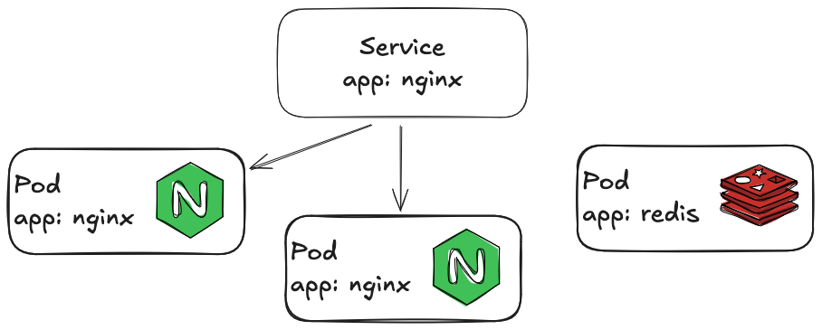

# Kubernetes

Finally we have the basis in place for starting to talk about what we are here
for Kubernetes. In this first chapter we will explain some of the primitives
and the patterns of how Kubernetes works.

{}
I might use k8s as abbreviation of Kubernetes.
{}

As briefly mentioned earlier it helps to think of Kubernetes as a container
orchestrator. It's main responsibility is to manage and deploy containers
across a cluster of servers. As a user the main way of interacting with
Kubernetes is by supplying it with declarative specifications of what
containers to deploy along with information about how they should be deployed.

As mentioned the Kubernetes APIs are declarative. This means that when we give
Kubernetes one of these specifications, it might take some time for it to take
effect. Some resources are quickly processed while others might take a while
to reach the desired state.

Desired state is an important concept when working with Kubernetes. When we
give Kubernetes a specification, it is the responsibility of Kubernetes to go
from the *actual state* to the *desired state*. This process is often referred
to as reconciliation. Whenever your hear the word reconciliation, think "actual
state to desired state".

We will now go through a few of the most commonly use APIs in Kubernetes. We
will use some of these directly, while others will be used indirectly (more on
this later).

## `Pod`

The Pod is the most important resource in Kubernetes. A Pod is one or more
containers which are living as a single inseparable unit. The containers share
localhost, meaning that their exposed ports cannot overlap.

Here is a simple specification of a Pod running the nginx container.

```yaml
apiVersion: v1
kind: Pod
metadata:
  name: nginx
spec:
  containers:
  - name: nginx
    image: nginx:1.14.2
    ports:
    - containerPort: 80
```

## `Deployment`

`Pod`'s in themselves are not very useful instead we usually use the
`Deployment` resource which enables us to run multiple instances of a `Pod`.

```yaml
apiVersion: apps/v1
kind: Deployment
metadata:
  name: nginx-deployment
  labels:
    app: nginx
spec:
  replicas: 3
  selector:
    matchLabels:
      app: nginx
  template:
    metadata:
      labels:
        app: nginx
    spec:
      containers:
      - name: nginx
        image: nginx:1.14.2
        ports:
        - containerPort: 80
```

For now lets ignore everything above the `spec:` line. First we have a line that
says we would like to have 3 replicas of our pod. In other words our desired
state is 3 pods.

Then we have a selector. Kubernetes uses the selector in order to determine if
it has reached the desired state. Kubernetes will check if we have 3 pods with
the label `app: nginx`, where their pod specification matches the template. If
that isn't the case, Kubernetes has work to do in order to make the actual state
become the desired state.

If we look at the `template` field of the `Deployment` specification, we might
notice that it looks very similar to the `Pod` specification. This is because
the `Deployment` has a Pod template, which it uses to create the Pods.

{}
The above explanation is a bit dumbed down. The deployment actually doesn't
create pods directly instead it uses another resource called a `ReplicaSet` if
you want a deeper understanding of how `Deployment`'s work. Read [the
documentation](https://kubernetes.io/docs/concepts/workloads/controllers/deployment/)
{}

## `Service`

By now we are able to create multiple instance of a `Pod` by using the
`Deployment` resource, but we have no way of sending a request to our
deployment. This is where the `Service` comes into play. A `Service` finds a set
of pods by a set of labels and assigns a cluster-internal DNS name.

```yaml
apiVersion: v1
kind: Service
metadata:
  name: nginx
spec:
  selector:
    app: nginx
  ports:
    - protocol: TCP
      port: 80
      targetPort: 80
```



In almost any modern IT architecture, multiple applications need to communicate
with each other. In Kubernetes `Service`s enable this by providing cluster
local DNS names that applications can use to reach each other.

## `Ingress`

Most systems need to be able to accept requests that originate outside of the
cluster. For instance, a website wouldn't provide much value if it couldn't be
reached from networks outside the k8s cluster. This is where the `Ingress`
resource comes into play. Where the `Service` mapped a cluster local DNS name to
set of `Pod`s, the `Ingress` resource maps a cluster external DNS name to a
`Service`.

The `Ingress` will often also have responsibility of doing TLS termination. In
order to do this an `Ingress` will need access to a `Secret` resource (see
section about [secrets and configmaps](#secrets-and-configmaps) for more
information about this). The `Secret` resource which is referenced by name holds
the certificate and private key used for TLS.

```yaml
apiVersion: networking.k8s.io/v1
kind: Ingress
metadata:
  name: nginx
spec:
  tls:
  - hosts:
      - foo.bar.com
    secretName: foo-bar-com-tls
  rules:
  - host: foo.bar.com
    http:
      paths:
      - path: /
        pathType: Prefix
        backend:
          service:
            name: nginx
            port:
              number: 80
```

## `Secret`s and `ConfigMap`s

We already saw one use of the `Secret` resource in the `Ingress` section.
Another even more common use of these resources is to provide `Pod`s
configuration values. I have grouped these two resources together as they are
equivalent in functionality and very similar in their APIs.

The main reason we have two different resources is to be able to create RBAC
rules which give granular access to each resource. It is common practice that
developers don't have read access to `Secret`s but only `ConfigMap`s.

There are two main ways of using these resources to provide configuration for
`Pod`s

- Their values can be injected into `Pod`s as environment variables
- Their values can be mounted into `Pod`s as files on the file system.

For some reason it was decided that the data of secrets needs to be base64
encoded, while the data of configmaps is plain text. There has since then been
added APIs in both of the resources, where you can do encoded or string data.

For instance the following secret and configmap holds the same data:

```yaml
apiVersion: v1
kind: Secret
metadata:
  name: my-secret
data:
  MY_KEY: aGVsbG8gd29ybGQ=

---

apiVersion: v1
kind: ConfigMap
metadata:
  name: my-configmap
data:
  MY_KEY: hello world
```

Please not that the secret isn't encrypted the value is merely base64 encoded.

When defining a workload we will usually use the `Deployment` resource. As
mentioned earlier, the `Deployment` resource has a `Pod` template which is used
to generate the `Pod`s that make out the `Deployment`. In this template we can
chose to reference a `ConfigMap` or a `Secret`, in order to use it's contents as
files or environment variables. See the next sections to see how this works.

### Mounting a configuration file

Our application might have a configuration file can be used to
configure how the application acts on runtime. In order to provide our
application with a configuration file we will first need to store it in a
configmap.

```yaml
apiVersion: v1
kind: ConfigMap
metadata:
  name: my-configmap
data:
  config.yaml: |
    mode: development
    otherConfigParam: hello
```

With the above configmap in place we can mount it to a folder like in the
container like this:

```yaml
apiVersion: apps/v1
kind: Deployment
metadata:
  name: my-app
  labels:
    app: my-app
spec:
  replicas: 3
  selector:
    matchLabels:
      app: my-app
  template:
    metadata:
      labels:
        app: my-app
    spec:
      containers:
      - name: my-app
        image: my-app
        volumeMounts:
        - name: config
          mountPath: /etc/my-app
  volumes:
  - name: config
    configMap:
      name: my-configmap
```

Every key in the configmap becomes a file inside of the container with the
contents of the value. In this case we would have a file at
`/etc/my-app/config.yaml` with the content

```yaml
mode: development
otherConfigParam: hello
```

The application can then read this file when it starts and configure it's
runtime behavior according to what the config file specifies.

### Setting environment variables

The other option for consuming `Secret`s and `ConfigMap`s is to use them as the
basis of environment variables.

Say our application needs access to an API which requires it to present an API
key. In order to provide this API key to our application we first create a
secret which will hold it.

```yaml
apiVersion: v1
kind: Secret
metadata:
  name: my-secret
data:
  API_KEY: bXkgdmVyeSBzZWNyZXQgQVBJIGtleQ==
```

With the above secret in place we can tell our pods to use the secret as
environment variables.

```yaml
apiVersion: apps/v1
kind: Deployment
metadata:
  name: my-app
  labels:
    app: my-app
spec:
  replicas: 3
  selector:
    matchLabels:
      app: my-app
  template:
    metadata:
      labels:
        app: my-app
    spec:
      containers:
      - name: my-app
        image: my-app
        envFrom:
        - secretRef:
            name: my-secret
```

This will run the container with the environment variable `API_KEY` set to what
is found in the secret.

## Exercises

### Reading the value of a secret

As mentioned earlier, the values in a `Secret` are not encrypted but merely
base64 encoded. With this knowledge, what is the API key which was used in the
section about how to set environment variables?
